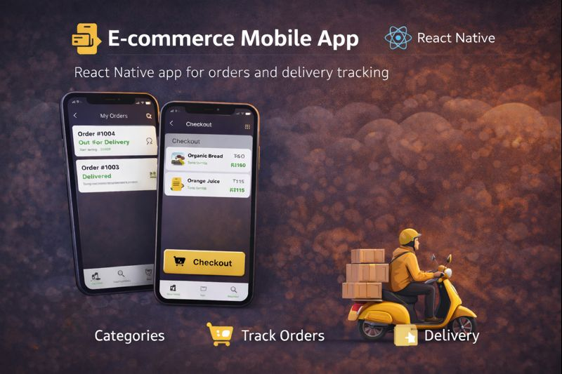

# ⚡ Flash Deliveries — Customer Mobile App

The **Flash Deliveries Mobile App** delivers a mobile-first ordering experience for groceries and restaurant food, optimized for speed and ease of use.

Built with **React Native (Expo)**.

🔗 Related Repositories:
- Backend API: https://github.com/asad2050/flash-deliveries-api
- Admin Dashboard: https://github.com/asad2050/flash-deliveries-admin
- Customer Web App: https://github.com/asad2050/flash-deliveries-web

---

## Screenshots
Coming soon...

## Demo Video

Coming soon...

---

## 📱 Features

### 🛒 Store
- Category browsing
- Product search
- Add to cart & checkout

### 🍽️ Restaurant
- Menu browsing
- Variant & add-on selection
- UPI-based payment flow (manual verification)

### 📦 Orders & Profile
- Order history
- Profile & address management

---

## 🛠️ Tech Stack

- React Native (Expo)
- TypeScript
- Zustand
- Axios
- Firebase Auth

---

## 🚧 Roadmap

- Unified checkout

- Order tracking using map

- Payment gateway integration

- SEO optimization

- Performance improvements

---
